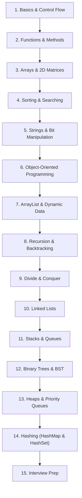

# 🚀 Java Fundamentals & Data Structures Mastery


Welcome to **Java Fundamentals & Data Structures Mastery** — a personal, structured learning repository designed to take developers from core Java syntax to Data Structures and Algorithms (DSA). The topic READMEs are the revision-first notes; the Java programs are supporting, runnable examples of the concepts they discuss.

---

## 🎯 Repository Goals & Description

This repository serves as a personal DSA textbook: learn the mental model, trace a worked example, understand the complexity and common mistakes, then inspect the matching Java example. It is organized around concepts, data structures, algorithms, and problem-solving patterns—not around individual online-judge submissions.

> The `Leetcode/` directory is preserved as existing repository material and is intentionally outside this documentation pass. Individual problem solutions belong in the separate LeetCode repository described by the repository owner.

### Who This Repository Is For
- **Beginners**: Learning fundamental Java syntax, loops, functions, and OOP principles.
- **Intermediate Developers**: Mastering classic data structures (Arrays, Linked Lists, Stacks, Queues, Trees, Heaps).
- **Interview Candidates**: Revising core DSA concepts and recognizing reusable patterns.

---

## 📊 Repository Statistics

| Metric | Quantity |
| :--- | :--- |
| **Total Topic Modules** | 19 Specialized Folders |
| **Total Java Programs** | 157 Fully Documented Files |
| **Total Lines of Java Code** | ~6,500 Lines |
| **Topic README Guides** | 21 Dedicated Guides |
| **License** | MIT Open Source |

---

## 📁 Folder Structure

```text
Java-Fundamentals-DSA/
├── Basics/                 # Core Java syntax, loops, conditions, functions
├── BitManipulation/        # Bitwise operators, bit masking, binary arithmetic
├── Strings/                # String immutability, StringBuilder, palindrome
├── Arrays/                 # 1D Arrays, Searching, Subarrays, Trapping Rainwater, Stocks
│   ├── 2D_Arrays/          # 2D Matrices, Spiral Matrix, Diagonal Sum, Matrix Search
│   └── Sorting/            # Bubble, Selection, Counting, and Inbuilt Sorting
├── ArrayList/              # Dynamic Arrays, Multi-dimensional ArrayList, Pair Sum
├── OOPS/                   # Classes, Constructors, Inheritance, Polymorphism, Encapsulation
├── RecursionBasics/        # Recursion fundamentals, Factorial, Fibonacci, Binary Strings
├── DivideAndRule/          # Divide & Conquer algorithms (Merge Sort)
├── Backtracking/           # Backtracking on arrays, Subset generation
├── LinkedList/             # Singly Linked List, Add/Remove, Cycle Detection
├── Stacks/                 # Stacks via ArrayList, LinkedList, JCF; Histogram, Parentheses
├── Queue/                  # Queues, Deque, Queue using Stacks, Interleaving, Reversal
├── Greedy/                 # Greedy Algorithms (Activity Selection)
├── BinaryTree/             # Tree Creation, Height, Metrics, Traversal
├── BinarySearchTree/       # BST Creation, Search, Deletion, Range Queries, Largest BST
├── Heaps/                  # Priority Queue, Custom Object Priority Queue, Heap Insertion
├── Hashing/                # HashMap, HashSet, LinkedHashMap, TreeMap, Custom HashMap, Anagram, Subarray Sums
├── Practice/               # Additional practice problems organized by topic
├── CONTRIBUTING.md         # Contribution guidelines and coding standards
├── LICENSE                 # MIT License
└── README.md               # Main repository documentation
```

---

## 📚 Topics Covered

| Topic | Primary Module | Key Concepts Covered |
| :--- | :--- | :--- |
| **Java Basics** | [Basics/](Basics/) | Conditionals, loops (`for`, `while`), functions, method overloading, prime check |
| **Bitwise Operations** | [BitManipulation/](BitManipulation/) | Bitwise AND, OR, XOR, NOT, shift operators, bit masking |
| **String Handling** | [Strings/](Strings/) | String immutability, `char` manipulation, `StringBuilder`, palindrome |
| **1D & 2D Arrays** | [Arrays/](Arrays/) | Subarrays, Kadane's Algorithm, Trapping Rainwater, Stock Buy/Sell, Spiral Matrix |
| **Sorting Algorithms** | [Arrays/Sorting/](Arrays/Sorting/) | Bubble Sort, Selection Sort, Counting Sort, `Arrays.sort()` |
| **Dynamic Arrays** | [ArrayList/](ArrayList/) | Dynamic sizing, 2D ArrayLists, Container With Most Water, Pair Sum |
| **Object-Oriented Programming** | [OOPS/](OOPS/) | Classes, Objects, Access Modifiers, Constructors (Shallow/Deep Copy), Inheritance |
| **Recursion & Backtracking** | [RecursionBasics/](RecursionBasics/) | Base cases, call stack, array backtracking, subset generation |
| **Divide & Conquer** | [DivideAndRule/](DivideAndRule/) | Merge Sort algorithm breakdown |
| **Linear Data Structures** | [LinkedList/](LinkedList/), [Stacks/](Stacks/), [Queue/](Queue/) | Singly Linked Lists, Stacks, Queues, Deque, Monotonic Stacks, Interleaving |
| **Hierarchical Data Structures**| [BinaryTree/](BinaryTree/), [BinarySearchTree/](BinarySearchTree/), [Heaps/](Heaps/) | Binary Trees, BSTs, Inorder Successor, Priority Queue, Min/Max Heaps |
| **Hashing Data Structures** | [Hashing/](Hashing/) | HashMap, HashSet, LinkedHashMap, TreeMap, Custom HashMap Implementation, Anagrams |

---

## ⚡ How to Compile and Run Programs

You can compile and run any Java program natively using the Java CLI (`javac` and `java`).

### Step-by-Step Execution Guide:

```bash
# 1. Clone the repository
git clone https://github.com/Divyansh-2309git/My-Data-Java_DSA.git
cd My-Data-Java_DSA

# 2. Compile a specific program (e.g. Arrays/BinarySearch.java or Hashing/ValidAnagram.java)
javac Hashing/ValidAnagram.java

# 3. Run the compiled program
java Hashing.ValidAnagram
```

*Note: You can easily clean generated `.class` files using `find . -name "*.class" -delete`.*

---

## 🗺️ Learning Roadmap



---

## 🤝 Contribution Guide

Contributions are always welcome! Please check out [CONTRIBUTING.md](CONTRIBUTING.md) for full guidelines on adding new problems or improving existing documentation.

1. Fork the Repository.
2. Create a Feature Branch (`git checkout -b feature/new-topic`).
3. Ensure your Java code includes the standard header block and compiles cleanly (`javac`).
4. Submit a Pull Request.

---

## 🔮 Future Roadmap

- [x] **Hashing** (HashMap, HashSet, Custom Hash Functions, Collision Resolution)
- [ ] **Trie Data Structure** (Prefix Tree, Word Search)
- [ ] **Graph Algorithms** (Adjacency Matrix/List, BFS, DFS, Topological Sort, Dijkstra)
- [ ] **Dynamic Programming** (1D DP, 2D DP, 0/1 Knapsack, LCS)
- [ ] **Segment Trees & Disjoint Set Union (DSU)**

---

## 📄 License

This repository is distributed under the [MIT License](LICENSE).

---

## 📧 Contact & Connect

Developed & Maintained by **Divyansh**  
GitHub: [@Divyansh-2309git](https://github.com/Divyansh-2309git)
